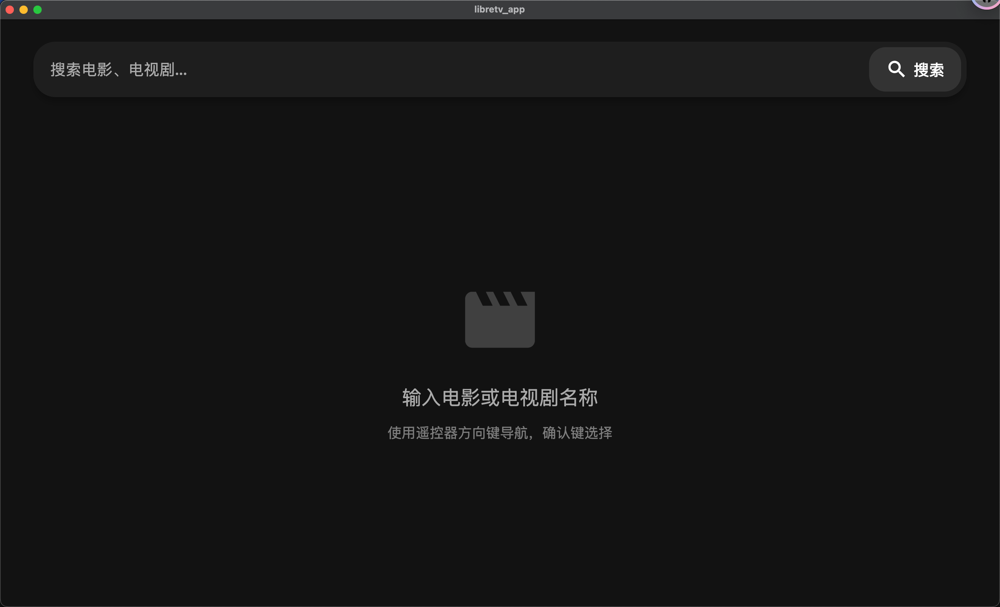
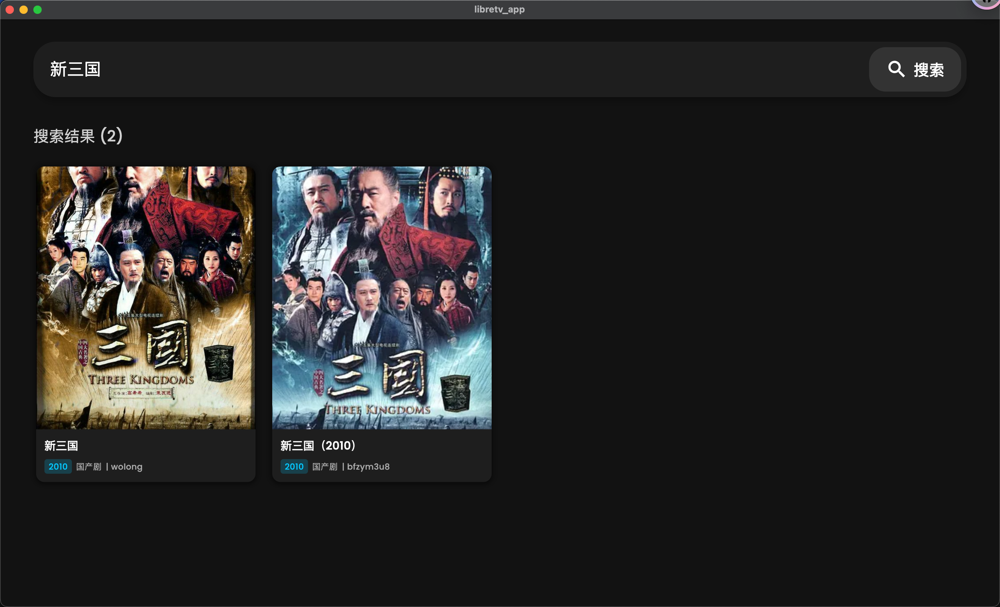
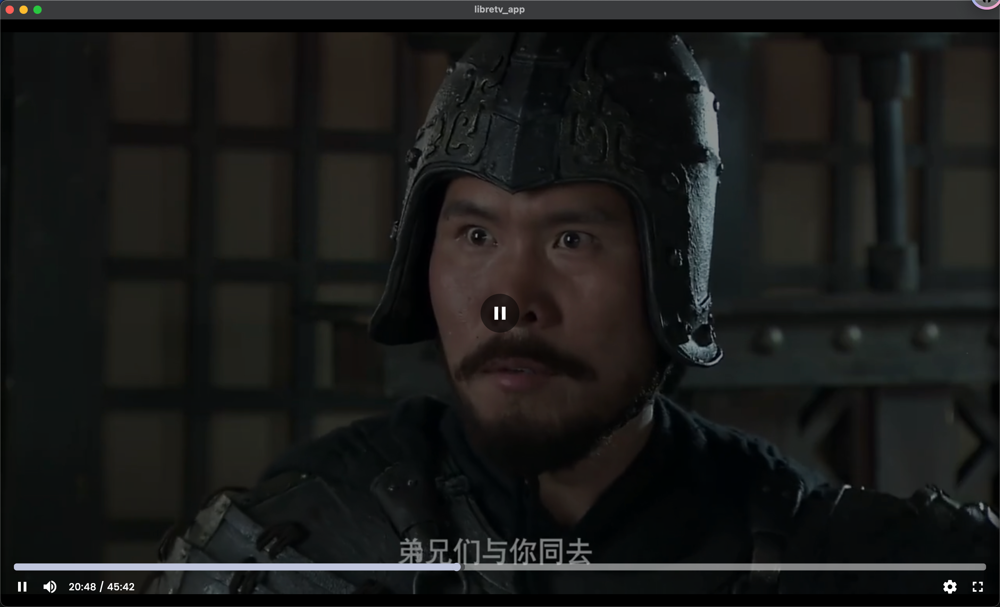
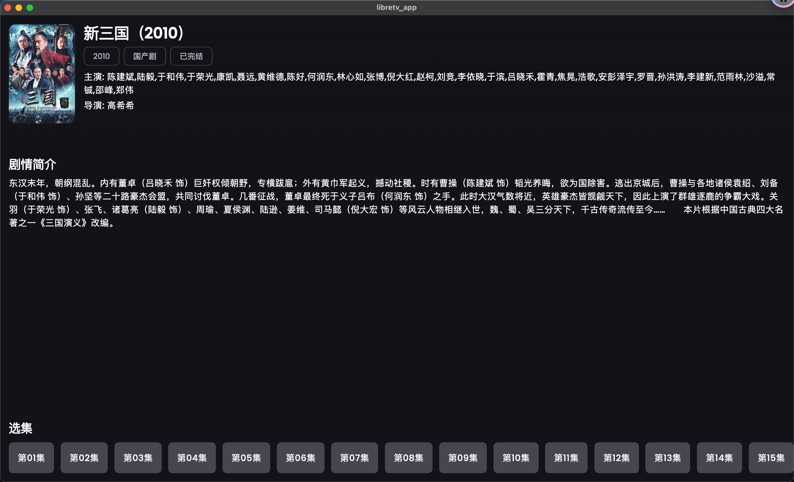
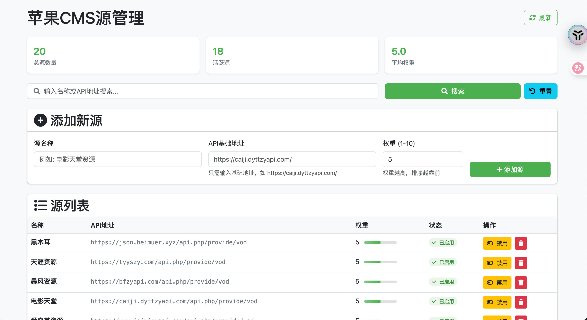

```markdown
---

# LibreTV 应用

一个基于 **Flutter** 开发的智能电视/机顶盒视频播放应用，支持多种视频格式和网络流媒体播放，专为电视遥控器操作优化。

---

## 📺 功能特性

- 🎬 **多格式支持**：播放 MP4、HLS、MKV 等主流视频格式
- 📺 **遥控器优化**：专为电视/机顶盒遥控器操作设计
- 🔍 **快速导航**：支持选集、章节跳转
- ⏯️ **播放控制**：播放/暂停、快进/快退、进度条拖动
- 🔉 **音量调节**：支持系统音量控制
- 🌙 **屏幕常亮**：播放时防止设备休眠
- 📡 **API 聚合**：支持多视频源 API 接口
- 💾 **本地源管理**：支持通过Web界面管理本地视频源和代理设置
- ⚙️ **动态配置**：支持远程加载配置文件初始化系统

---

## 🛠️ 技术栈

| 技术/组件       | 用途                     |
|----------------|--------------------------|
| Flutter 3.x    | 跨平台应用开发框架        |
| Dart 3.x       | 编程语言                 |
| `video_player` | 核心视频播放功能         |
| `chewie`       | 播放器 UI 控件           |
| `wakelock_plus`| 屏幕常亮控制             |

---

## ⚙️ 系统初始化配置

应用启动时会从以下URL加载默认配置：
`https://ktv.aini.us.kg/config.json`

### 配置文件格式示例：
```json
{
	"sources": [
		{
			"name": "xx资源",
			"url": "https://xxx.com/api.php/provide/vod",
			"weight": 5,
			"disabled": false
		},
		// 更多视频源...
	],
	"proxy": {
		"name": "默认代理",
		"enabled": true,
		"url": "https://proxy.aini.us.kg"
	}
}
```

### 配置参数说明：
- `sources`: 视频源列表
    - `name`: 资源名称
    - `url`: API地址
    - `weight`: 权重(1-10)
    - `disabled`: 是否禁用
- `proxy`: 代理设置
    - `name`: 代理名称
    - `enabled`: 是否启用
    - `url`: 代理服务器地址

---

## 💻 本地源管理

LibreTV 提供 Web 管理界面用于管理视频源和代理设置：

1. **访问管理界面**：
    - 在浏览器中输入：`http://[设备IP地址]:8023`
    - 示例：`http://192.168.1.100:8023`

2. **管理功能**：
    - 添加/编辑/删除视频源
    - 配置代理服务器
    - 调整资源权重
    - 启用/禁用特定资源

---

---

## 📸 应用截图

<div align="center">
  
  
  
  
  
</div>


## 📜 开源协议 (MIT License)

```text
Copyright (c) 2023 LibreTV Team

Permission is hereby granted, free of charge, to any person obtaining a copy
of this software and associated documentation files (the "Software"), to deal
in the Software without restriction, including without limitation the rights
to use, copy, modify, merge, publish, distribute, sublicense, and/or sell
copies of the Software, and to permit persons to whom the Software is
furnished to do so, subject to the following conditions:

The above copyright notice and this permission notice shall be included in all
copies or substantial portions of the Software.

THE SOFTWARE IS PROVIDED "AS IS", WITHOUT WARRANTY OF ANY KIND, EXPRESS OR
IMPLIED, INCLUDING BUT NOT LIMITED TO THE WARRANTIES OF MERCHANTABILITY,
FITNESS FOR A PARTICULAR PURPOSE AND NONINFRINGEMENT. IN NO EVENT SHALL THE
AUTHORS OR COPYRIGHT HOLDERS BE LIABLE FOR ANY CLAIM, DAMAGES OR OTHER
LIABILITY, WHETHER IN AN ACTION OF CONTRACT, TORT OR OTHERWISE, ARISING FROM,
OUT OF OR IN CONNECTION WITH THE SOFTWARE OR THE USE OR OTHER DEALINGS IN THE
SOFTWARE.
```

---

## ⚠️ 免责声明

1. **技术演示用途**：本应用仅为 Flutter 开发技术演示，不提供任何视频内容。
2. **内容来源**：所有视频内容均来自第三方 API 接口或用户本地资源，开发者无法控制其内容合法性。
3. **无存储功能**：应用本身不存储、不缓存任何视频资源。
4. **用户责任**：使用者应遵守所在地区法律法规，禁止传播违法内容。
5. **责任豁免**：因使用本应用产生的任何法律纠纷，开发者不承担任何责任。

---

## 🛠️ 开发环境

```bash
# 1. 安装依赖
flutter pub get

# 2. 运行应用（连接设备或模拟器）
flutter run

# 3. 构建APK（Android）
flutter build apk --release
```

**系统要求**：
- Flutter SDK ≥ 3.0
- Dart ≥ 3.0
- Android Studio / VS Code

---

## 📚 参考资料

- [Flutter 官方文档](https://docs.flutter.dev/)
- [Dart 语言指南](https://dart.dev/guides)
- [video_player 插件文档](https://pub.dev/packages/video_player)
- [TV 应用设计规范](https://developer.android.com/design/tv)

---

## 🙏 鸣谢

特别感谢 [LibreSpark/LibreTV](https://github.com/LibreSpark/LibreTV) 项目作者提供的灵感和技术思路。

---

> ✨ 欢迎贡献代码！请提交 Pull Request 到 `dev` 分支。  
> 🐞 问题反馈：<laopaoer@protonmail.com>